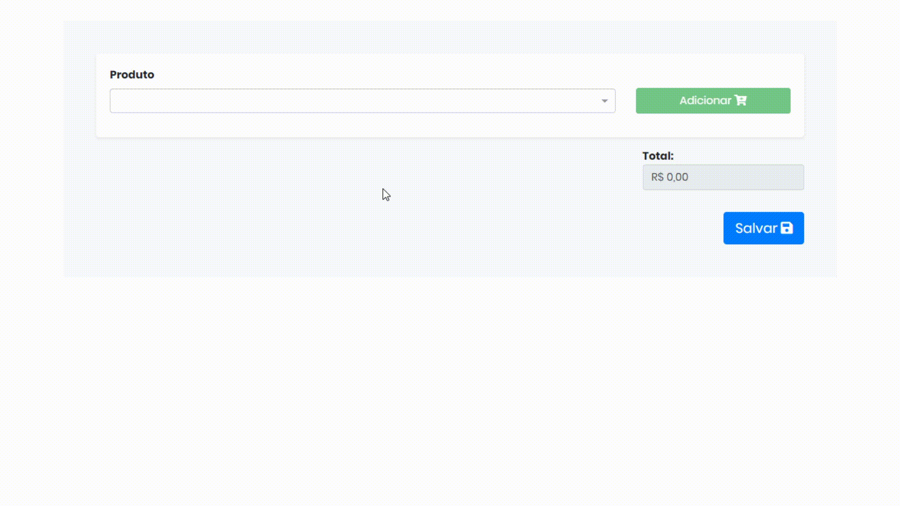

## Sumario

- [Demo](#demo)
- [Requisitos](#requisitos)
- [Docker](#docker)
- [Database Migrations](#database-migrations)

# Demo


## Requisitos

- Postgres: `^13`
- Java: `^17`
- Maven: `^3.8.4`

## Docker
> 🚨 certifique-se que o arquivo de `environment` foi criado
> e instale os pacotes do npm (somente para o development do web)
>
> ```bash
>  cp docker/.env.example docker/.env
> ```
>
> ```bash
>  docker run -it --rm -w /usr/app -v $(pwd)/web:/usr/app node:16.14.2 npm install --legacy-peer-deps
> ```

- docker compose development
    ```bash
    docker-compose -p vendas-development -f ./docker/docker-compose.dev.yml --env-file ./docker/.env up -d --force-recreate
    ```

- docker compose production
    ```bash
    docker-compose -p vendas -f ./docker/docker-compose.prod.yml --env-file ./docker/.env up -d --build
    ```

## Database Migrations
> 🚨 cerifique-se de que tem o maven no seu ambiente
> e que você esta no diretório __./api__

Criando arquivos de migração de banco de dados

- Baseado em arquivo java
  ```bash
  mvn migration:generate -Dname=my-migration-name
  ```

- Baseado em arquivo sql
  ```bash
  mvn migration:generate -Dname=my-migration-name -Dsql
  ```
